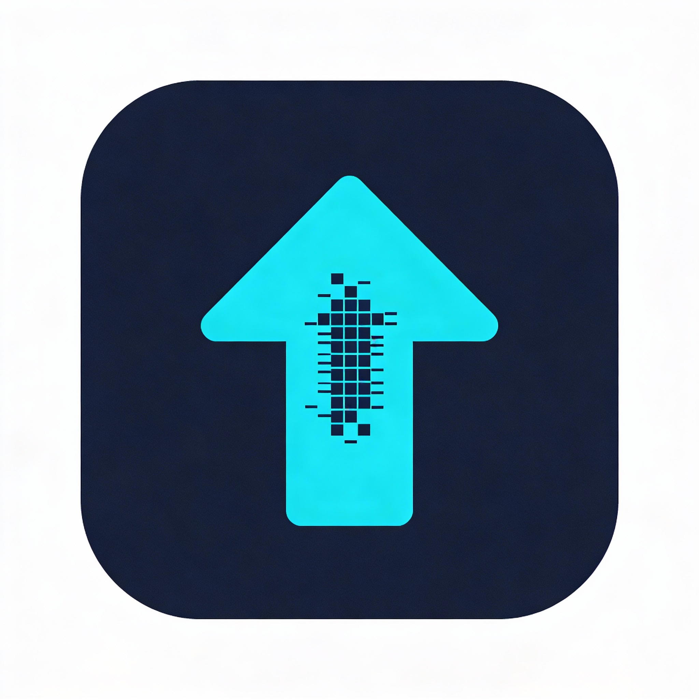
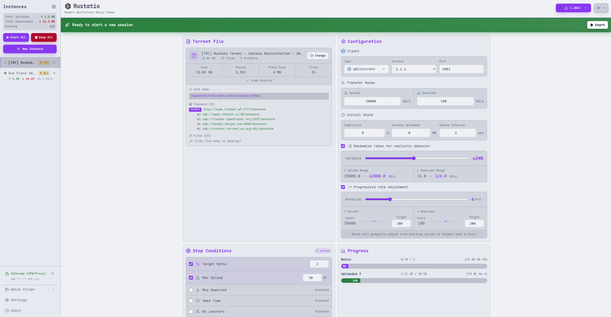
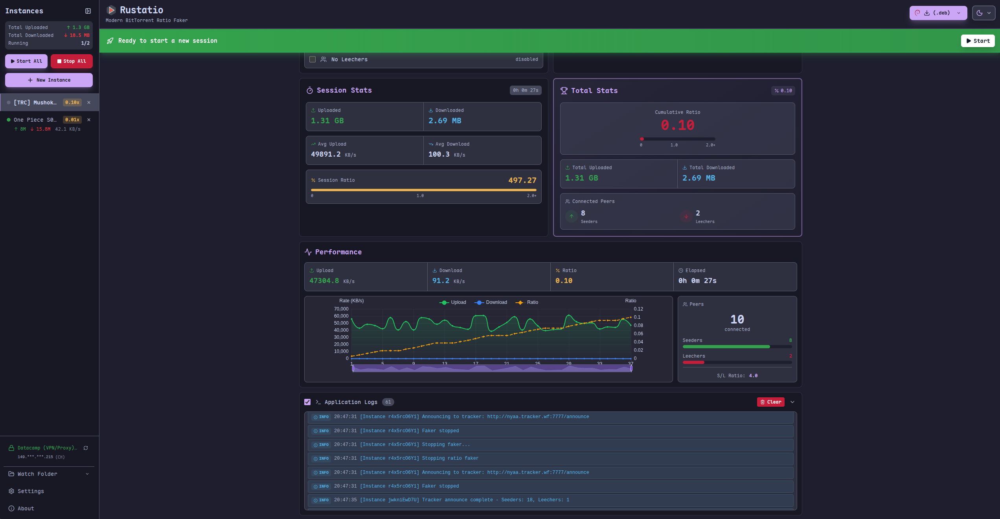
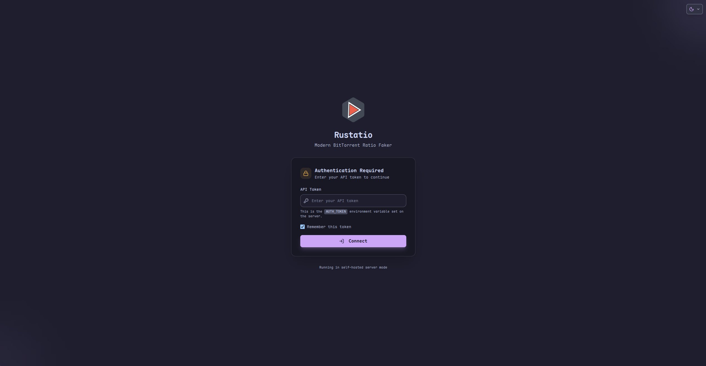

<div align="center">
  
</div>

# 🚀 Rustatio

A modern, cross-platform BitTorrent ratio management tool that emulates popular torrent clients. Built with Rust and Tauri for a fast, native desktop experience.

Accurately simulate seeding behavior by emulating **uTorrent**, **qBittorrent**, **Transmission**, **Deluge**, **BitTorrent**, or **rTorrent** with customizable upload/download rates and tracker interactions.

> [!IMPORTANT]
> This tool is for **educational purposes only**. Manipulating upload/download statistics on BitTorrent trackers may violate the terms of service of private trackers and could result in account suspension or ban. Use at your own risk.

## 🎥 Demo

[https://github.com/user-attachments/assets/2285bd54-95f3-4a56-b62a-978465abfa0f](https://github.com/user-attachments/assets/2285bd54-95f3-4a56-b62a-978465abfa0f)

## 📸 Screenshots

<table>
  <tr>
    <td width="50%">
      
      <p align="center"><em>Light Theme - Main Interface</em></p>
    </td>
    <td width="50%">
      
      <p align="center"><em>Dark Theme - Main Interface</em></p>
    </td>
  </tr>
  <tr>
    <td width="50%">
      
      <p align="center"><em>Active Torrent with Performance Charts</em></p>
    </td>
    <td width="50%">
      
      <p align="center"><em>Authentication for Self-Hosted version</em></p>
    </td>
  </tr>
</table>

## Features

- **Modern GUI**: Built with Tauri and Svelte 5
- **Cross-platform**: Linux, Windows, and macOS
- **Client emulation**: uTorrent, qBittorrent, Transmission, Deluge, BitTorrent, and rTorrent
- **Multi-instance support**: Run and manage multiple torrents at the same time
- **Realistic statistics**: Randomize rates and ratio, or ramp them up progressively
- **Stop conditions**: Stop automatically at a target ratio, upload/download amount, or seed time
- **Idle handling**: Pause announces when there are no leechers or seeders
- **Performance analytics**: Live upload/download stats and interactive charts
- **Watch folder**: Automatically load new `.torrent` files from a directory
- **VPN port sync** (Docker): Follow Gluetun's forwarded port automatically
- **TOML configuration** and detailed console logging

## Getting Started

Rustatio runs as a native desktop app or as a self-hosted Docker server with a web UI.

### Desktop

Download the latest release for your platform from [Releases](https://github.com/takitsu21/rustatio/releases).

**Windows**

1. Run the setup installer
2. Launch Rustatio from the Start Menu

**macOS**

1. Open the `.dmg` file and drag Rustatio to your Applications folder
2. Launch it from Applications (you may need to allow it in System Settings → Privacy & Security)

**Linux**

Debian/Ubuntu:

```bash
sudo apt install ./Rustatio_*.deb
```

Fedora/RHEL/CentOS:

```bash
sudo dnf install Rustatio-*.rpm
```

Arch Linux ([AUR](https://aur.archlinux.org/packages/rustatio-bin)):

```bash
yay -S rustatio-bin
# or
paru -S rustatio-bin
```

AppImage (universal):

```bash
chmod +x Rustatio_*.AppImage && ./Rustatio_*.AppImage
```

### Docker (Self-Hosted)

Run Rustatio on a server, NAS, or any Docker-enabled system and access the web UI from any device on your network.

The recommended setup routes all tracker requests through a VPN using [gluetun](https://github.com/qdm12/gluetun). The VPN is optional, but running Rustatio without one is at your own risk.

Create a `docker-compose.yml`:

```yaml
services:
  gluetun:
    image: qmcgaw/gluetun
    cap_add:
      - NET_ADMIN
    devices:
      - /dev/net/tun:/dev/net/tun
    environment:
      # Configure your VPN provider - see https://github.com/qdm12/gluetun-wiki
      - VPN_SERVICE_PROVIDER=protonvpn # or: mullvad, nordvpn, expressvpn, etc.
      - VPN_TYPE=wireguard # or: openvpn
      - VPN_PORT_FORWARDING=on # if you want to enable port forwarding
      # Provider-specific settings (example for ProtonVPN WireGuard)
      - WIREGUARD_PRIVATE_KEY=${WIREGUARD_PRIVATE_KEY}
      - SERVER_COUNTRIES=${SERVER_COUNTRIES:-Switzerland}
      # Gluetun control server auth (v3.39.1+ defaults to private routes)
      # Generate a key with: docker run --rm qmcgaw/gluetun genkey
      - HTTP_CONTROL_SERVER_AUTH_DEFAULT_ROLE={"auth":"apikey","apikey":"${GLUETUN_API_KEY:-CHANGE_ME}"}
    ports:
      - "${WEBUI_PORT:-8080}:8080" # Rustatio Web UI
    restart: unless-stopped

  rustatio:
    image: ghcr.io/takitsu21/rustatio:latest
    container_name: rustatio
    environment:
      - PORT=8080
      - RUST_LOG=${RUST_LOG:-trace}
      - VPN_PORT_SYNC=${VPN_PORT_SYNC:-on} # follow gluetun's forwarded port
      - GLUETUN_CONTROL_SERVER_API_KEY=${GLUETUN_API_KEY:-CHANGE_ME}
      - PUID=${PUID:-1000}
      - PGID=${PGID:-1000}
      # Optional: protect the web UI with a secret token
      # - AUTH_TOKEN=${AUTH_TOKEN:-CHANGE_ME}
    volumes:
      - rustatio_data:/data
      # Optional: mount a folder to auto-load torrents from
      # - ${TORRENTS_DIR:-/path/to/your/torrents}:/torrents
    restart: unless-stopped
    network_mode: service:gluetun
    depends_on:
      gluetun:
        condition: service_healthy

volumes:
  rustatio_data:
```

Set your VPN provider credentials, then start it and open the web UI:

```bash
docker compose up -d
# http://localhost:8080 (or your server's IP)
```

| Variable | Description | Default |
|----------|-------------|---------|
| `PUID` / `PGID` | User and group ID used for file permissions on mounted volumes | `1000` |
| `AUTH_TOKEN` | Secret token required to access the web UI and API (generate with `openssl rand -hex 32`) | disabled |
| `PORT` | Internal server port | `8080` |
| `RUST_LOG` | Log level (`error`, `warn`, `info`, `debug`, `trace`) | `info` (`trace` in the example above) |
| `VPN_PORT_SYNC` | Follow Gluetun's forwarded port automatically (requires `VPN_PORT_FORWARDING=on`) | `on` in the example above |

**Watch folder**: create the host directory before starting the container (otherwise Docker creates it as root and the container can't read it), then uncomment the volume mount. New `.torrent` files are picked up automatically.

**Changing ports**: ports are published on the `gluetun` service. Change the host port there (for example `"3000:8080"`), and update the target port too if you change `PORT`.

**No VPN?** Remove the `gluetun` service and the `network_mode` line, then publish the port on `rustatio` directly. This is optional and done at your own risk.

## Usage

1. **Select Torrent**: choose your `.torrent` file
2. **Configure**: pick the client to emulate, set upload/download rates, port, and other options
3. **Start**: click Start to begin announcing
4. **Monitor**: watch live statistics and performance charts
5. **Stop**: click Stop when done

## Supported Clients

| Client | Latest supported version |
|--------|--------------------------|
| uTorrent | 3.5.5 |
| qBittorrent | 5.2.4 |
| Transmission | 4.1.3 |
| Deluge | 2.2.0 |
| BitTorrent | 7.11.0 |
| rTorrent | 0.16.24 |

Each client is emulated with its proper peer ID format, User-Agent header, HTTP protocol version, and query parameter ordering; older versions remain selectable in the UI.

## How It Works

1. **Torrent parsing**: reads the `.torrent` file and extracts the info hash and tracker URL
2. **Client spoofing**: generates authentic-looking peer IDs, keys, and headers for the selected client
3. **Stats simulation**: announces to the tracker with fake upload/download stats and re-announces at the tracker's interval

## Contributing

Contributions are welcome! See [CONTRIBUTING.md](CONTRIBUTING.md) for project setup and workflow.

## License

MIT License - see [LICENSE](LICENSE) for details.

## Credits

- Inspired by [RatioMaster.NET](https://github.com/NikolayIT/RatioMaster.NET), reimagined in Rust with a simpler cross-platform UI
- Built with [Tauri](https://tauri.app/), [Svelte 5](https://svelte.dev/), [Tailwind CSS](https://tailwindcss.com/), and [shadcn-svelte](https://www.shadcn-svelte.com/)
